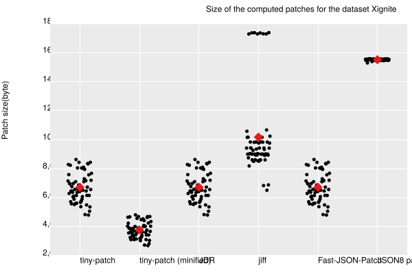
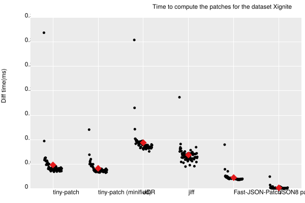
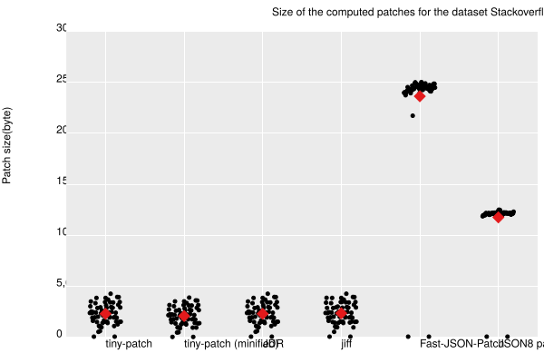
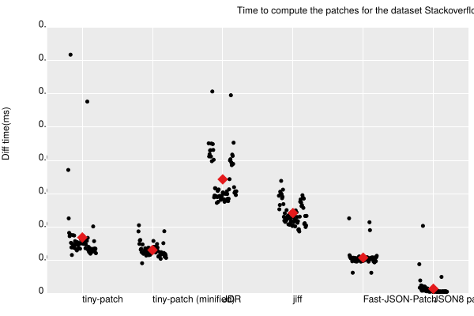
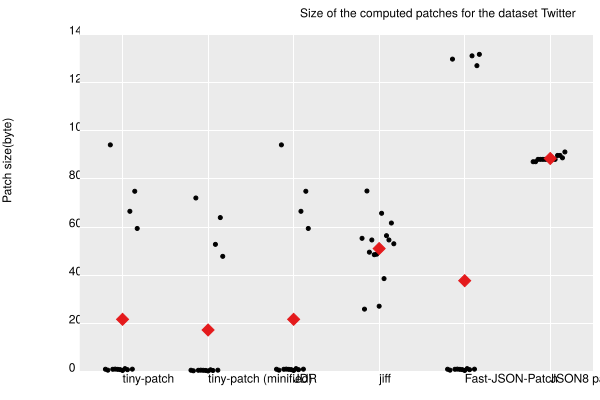
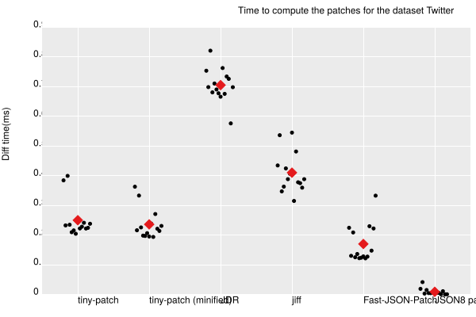

# Results

This document outlines the performance of the different available algorithms against the
[JSON diff dataset](https://github.com/caohanyang/json_diff_rfc6902/tree/master/dataset)

## Results

Documented below is the performance of the different available algorithms against each dataset

### Xignite

|  |  |
| --- | --- |
| a) Patch size | b) Diff time |

#### Averages
| Library | Patch Size Avg (bytes) | Diff-time Avg |
| ------- | ---------------------- | ------------------ |
| tiny-patch (minified) | 3756 | 47.237μs |
| tiny-patch | 6705 | 64.335μs |
| JDR | 6705 | 100.488μs |
| Fast-JSON-Patch | 6705 | 22.871μs |
| rfc6902 | 6705 | 5660.274μs |
| jiff | 10167 | 72.059μs |
| JSON8 patch | 15511 | 1.744μs |

### Stackoverflow

|  |  |
| --- | --- |
| a) Patch size | b) Diff time |

#### Averages
| Library | Patch Size Avg (bytes) | Diff-time Avg |
| ------- | ---------------------- | ------------------ |
| tiny-patch (minified) | 2077 | 28.913μs |
| rfc6902 | 2262 | 2205.024μs |
| tiny-patch | 2297 | 34.792μs |
| JDR | 2297 | 74.565μs |
| jiff | 2349 | 51.365μs |
| JSON8 patch | 11749 | 3.479μs |
| Fast-JSON-Patch | 23622 | 21.944μs |

### Twitter

|  |  |
| --- | --- |
| a) Patch size | b) Diff time |

#### Averages
| Library | Patch Size Avg (bytes) | Diff-time Avg |
| ------- | ---------------------- | ------------------ |
| rfc6902 | 4900 | 24691.465μs |
| tiny-patch (minified) | 17276 | 236.137μs |
| tiny-patch | 21704 | 250.221μs |
| JDR | 21704 | 705.133μs |
| Fast-JSON-Patch | 37745 | 170.172μs |
| jiff | 51080 | 410.301μs |
| JSON8 patch | 88479 | 8.955μs |

## Hardware
- Manufacturer: Apple
- Brand: M4 Pro
- Speed: 2.4GHz
